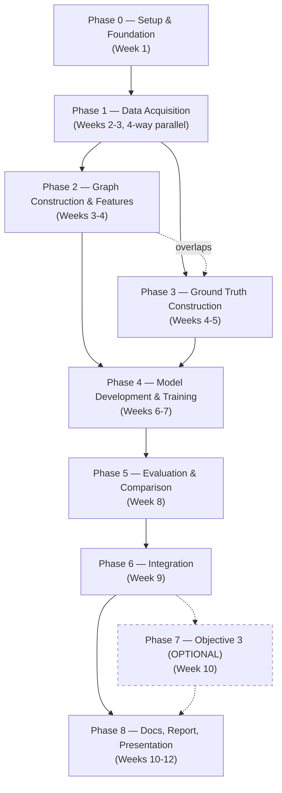

# Building the Project — Team Tracker

This is the **builder's document** — companion to [`working.md`](./working.md), which explains *why* the project is scoped this way and the technical rationale for every decision. This document is about *who does what, when, and in what order*. Update the Status column as you go; that's the whole point of this file.

**Team:**
- **P1 — Geospatial & Graph Lead:** Indla Sai Sneha
- **P2 — Ground Truth & Data Lead:** Srivatsalya Bhavaraju
- **P3 — ML/GNN Lead:** Jonathan S Pulickal
- **P4 — NLP / Objective 2 (+3) Lead:** Anurag Reddy Thumma

> Role labels are *leads*, not solo ownership — most phases need cross-support. Swap these around based on actual skills/interest; the important thing is that all 4 roles are covered by someone.

**Timeline:** 12 weeks (~3 months), 8 phases, Phase 7 (Objective 3) optional.

---

## 1. How to read this document

Every task has a stable **ID** (`P1.3`, `S0.2`, `O3.1`) and a **Depends on** column naming the exact ID(s) it needs finished first — not just "depends on graph work." When you finish a task, change its Status from `☐` to `✅`. If a task is blocked, leave it `☐` and check whether its dependency is done yet.

- `S#.#` = shared/all-hands task
- `P1.#` / `P2.#` / `P3.#` / `P4.#` = that person's track
- `O3.#` = Objective 3 (optional) tasks

---

## 2. Phase dependency map



**Reading this:** Phase 0 gates everything. Phase 1 is where all 4 people work independently at the same time. Phases 2 and 3 *overlap* rather than strictly sequence (P2's ground-truth work can start as soon as Phase 1's satellite/news data lands, it doesn't need P1's feature engineering finished). Phase 4 needs both 2 and 3 complete. Objective 2 (P4's track) runs almost entirely on its own rail from Phase 1 through Phase 5, only rejoining Objective 1's output at Phase 6 (Integration). Phase 7 is dashed because it's optional and only starts if Phase 6 is stable with time left.

## 3. Who's doing what, when (swimlanes)


**Sync points (all 4 people meet):** end of Phase 0 (go/no-go on city/event), end of Phase 3 (ground truth ready), end of Phase 5 (mid-project guide checkpoint), Phase 6 (integration — everyone's output merges), end of Phase 8 (final).

---

## 4. Phase 0 — Setup & Foundation (Week 1)

| # | Task | Owner | Depends on | Status |
|---|---|---|---|---|
| S0.1 | Create GitHub repo + local scaffold | P1 | — | ☐ |
| S0.2 | Set up shared Python environment (`requirements.txt`, venv/conda instructions in README) | P1 | S0.1 | ☐ |
| S0.3 | Finalize study city + select 10–20 contiguous wards | All | — | ☐ |
| S0.4 | Confirm flood event date range (default: Chennai, Nov–Dec 2015 — see working.md §1.9) | All | S0.3 | ☐ |
| S0.5 | Verify a usable Sentinel-1 pass exists near event dates over chosen wards (Copernicus Browser) | P2 | S0.4 | ☐ |
| S0.6 | Verify the Bhuvan RISAT flood-footprint layer is actually exportable, not just a figure caption | P2 | S0.4 | ☐ |
| S0.7 | **Go/no-go decision:** confirm Chennai, or fall back to Bengaluru 2022 | All | S0.5, S0.6 | ☐ |

**Exit criterion for Phase 0:** S0.7 checked off. Nothing in Phase 1 should start before this — it determines which OSM extent, which rainfall window, and which satellite pass everyone downloads.

---

## 5. Phase 1 — Data Acquisition (Weeks 2–3, parallel)

| # | Task | Owner | Depends on | Status |
|---|---|---|---|---|
| P1.1 | Pull OSM road network for study wards (`osmnx`) | P1 | S0.7 | ☐ |
| P1.2 | Pull OSM drainage/waterway layer for study wards | P1 | S0.7 | ☐ |
| P1.3 | Pull/verify ward boundary polygons (DataMeet/BBMP/GCC per city) | P1 | S0.7 | ☐ |
| P1.4 | Manual coverage check of drainage tagging completeness in chosen wards | P1 | P1.2 | ☐ |
| P2.1 | Download SRTM DEM tiles for study area (OpenTopography) | P2 | S0.7 | ☐ |
| P2.2 | Derive slope raster (`gdaldem slope`) | P2 | P2.1 | ☐ |
| P2.3 | Pull hourly rainfall for event window (Open-Meteo API) | P2 | S0.7 | ☐ |
| P2.4 | Pull daily IMD rainfall as cross-check (`imdlib`/`imddaily`) | P2 | S0.7 | ☐ |
| P2.5 | Set up Google Earth Engine access + Sentinel-1 GRD collection query | P2 | S0.7 | ☐ |
| P3.1 | Set up Colab/Kaggle GPU environment | P3 | S0.2 | ☐ |
| P3.2 | Install & smoke-test PyTorch Geometric + PyTorch Geometric Temporal | P3 | P3.1 | ☐ |
| P3.3 | Prototype A3TGCN vs MPNN-LSTM on toy/synthetic graph data | P3 | P3.2 | ☐ |
| P4.1 | Collect social media posts scoped to study wards + event window | P4 | S0.7 | ☐ |
| P4.2 | Draft initial gazetteer (road/locality/landmark names) | P4 | P1.1, P1.3 | ☐ |

**Note the one cross-track dependency in this "parallel" phase:** P4.2 needs P1.1 and P1.3 to exist first (the gazetteer is built from OSM data). Everything else in Phase 1 is fully independent — this is the biggest parallelism window in the whole project.

---

## 6. Phase 2 — Graph Construction & Features (Weeks 3–4)

| # | Task | Owner | Depends on | Status |
|---|---|---|---|---|
| P1.5 | Build primal graph (`networkx`) from OSM road+drainage data | P1 | P1.1, P1.2, P1.4 | ☐ |
| P1.6 | Transform primal → line graph (segment = node) | P1 | P1.5 | ☐ |
| P1.7 | Compute static node features: elevation, slope, length, distance_to_drain | P1 | P1.6, P2.1, P2.2 | ☐ |
| P1.8 | *(Optional)* Compute impervious %, ward population density | P1 | P1.7 | ☐ |
| P2.6 | Aggregate rainfall into phase-window dynamic features (`rainfall_t`, `cumulative_rainfall_t`) | P2 | P2.3, P2.4 | ☐ |
| P2.7 | Attach dynamic features to graph nodes per timestep | P2 | P2.6, P1.6 | ☐ |
| P3.4 | Define model input schema (`X_t`, `edge_index`, `Y_{t+1}` shapes) | P3 | P1.7, P2.7 | ☐ |
| P3.5 | Build graph-snapshot dataset/data-loader class | P3 | P3.4 | ☐ |
| P4.3 | Finalize gazetteer (`name → coordinate` dict) | P4 | P4.2 | ☐ |
| P4.4 | Implement fuzzy string matching pipeline (`rapidfuzz`) against gazetteer | P4 | P4.3 | ☐ |
| P4.5 | Hand-label distress/not-distress dataset (few hundred posts) | P4 | P4.1 | ☐ |

---

## 7. Phase 3 — Ground Truth Construction (Weeks 4–5)

This is the highest-risk phase in the project (see working.md §1.5) — treat P2.8–P2.11 as the critical path.

| # | Task | Owner | Depends on | Status |
|---|---|---|---|---|
| P2.8 | Run Sentinel-1 SAR change detection in GEE (before/after backscatter) | P2 | P2.5, S0.5 | ☐ |
| P2.9 | Extract Bhuvan RISAT flood footprint (if Chennai chosen) | P2 | S0.6 | ☐ |
| P2.10 | Cross-check with news/traffic advisories; geocode named roads via gazetteer | P2 | P4.3, P2.8, P2.9 | ☐ |
| P2.11 | **Fuse into 4-phase label scheme** (Pre-event / Rising / Peak / Receding) per segment | P2 | P2.10, P1.6 | ☐ |
| P1.9 | Freeze graph structure (no more topology changes after this point) | P1 | P1.7 | ☐ |
| P1.10 | Build rule-based baseline propagation model | P1 | P1.9 | ☐ |
| P3.6 | Build training/eval harness skeleton (phase-based train/test split, metrics) | P3 | P3.5 | ☐ |
| P4.6 | Fine-tune MuRIL/IndicBERT distress classifier on labeled data | P4 | P4.5 | ☐ |

**Exit criterion for Phase 3:** P2.11 checked off — this is the mid-project sync point. Phase 4 cannot meaningfully start without fused ground truth.

---

## 8. Phase 4 — Model Development & Training (Weeks 6–7)

| # | Task | Owner | Depends on | Status |
|---|---|---|---|---|
| P3.7 | Train GraphSAGE + temporal layer (A3TGCN/MPNN-LSTM) on fused ground truth | P3 | P2.11, P3.6 | ☐ |
| P3.8 | Hyperparameter tuning | P3 | P3.7 | ☐ |
| P1.11 | Run baseline model predictions across all phases | P1 | P1.10, P2.11 | ☐ |
| P2.12 | Iterate/fix ground-truth issues surfaced during training (feedback loop) | P2 | P3.7 | ☐ |
| P4.7 | Integrate classifier + gazetteer resolution into one end-to-end Objective 2 pipeline | P4 | P4.4, P4.6 | ☐ |

---

## 9. Phase 5 — Evaluation & Comparison (Week 8)

| # | Task | Owner | Depends on | Status |
|---|---|---|---|---|
| P3.9 | Compute F1/accuracy per phase transition — GNN model | P3 | P3.8 | ☐ |
| P1.12 | Compute F1/accuracy per phase transition — baseline model | P1 | P1.11 | ☐ |
| S5.1 | **Baseline vs. GNN comparison** — plots/tables, test the core claim (working.md §1.6) | P1 + P3 | P3.9, P1.12 | ☐ |
| P2.13 | Sanity-check ground truth against any comparison anomalies | P2 | S5.1 | ☐ |
| P4.8 | Evaluate Objective 2 precision/recall (classification + geoparsing accuracy) | P4 | P4.7 | ☐ |
| S5.2 | **Mid-project guide checkpoint meeting** | All | S5.1, P4.8 | ☐ |

---

## 10. Phase 6 — Integration (Week 9)

| # | Task | Owner | Depends on | Status |
|---|---|---|---|---|
| S6.1 | Build Streamlit/Folium dashboard skeleton | P1 | S5.1 | ☐ |
| S6.2 | Add graph-state animation layer (baseline vs. GNN over time) | P1 | S6.1 | ☐ |
| S6.3 | Add distress marker layer from Objective 2 | P4 | S6.1, P4.8 | ☐ |
| S6.4 | Polish model outputs and write up results | P2 + P3 | S5.1 | ☐ |

**This is where Objective 1 and Objective 2 visibly become one system** — the dashboard is the artifact that proves it.

---

## 11. Phase 7 — Objective 3 (OPTIONAL, Week 10)

> Only start this phase if Phases 1–6 are complete and stable with time to spare. If not — skip straight to Phase 8. The project is fully defensible on Objectives 1 and 2 alone (see working.md §3.3, §7).

| # | Task | Owner | Depends on | Status |
|---|---|---|---|---|
| O3.1 | Build ward-level vulnerability index (Census 2011 proxies) | P4 | S6.4 | ☐ |
| O3.2 | Set up OR-Tools/PuLP constrained optimizer | P4 | O3.1, S6.3 | ☐ |
| O3.3 | Produce ranked/allocated resource plan per ward | P4 | O3.2 | ☐ |

---

## 12. Phase 8 — Documentation, Report, Presentation (Weeks 10–12)

| # | Task | Owner | Depends on | Status |
|---|---|---|---|---|
| S8.1 | Write final report | All | S6.4 | ☐ |
| S8.2 | Prepare slide deck | All | S8.1 | ☐ |
| S8.3 | Demo rehearsal | All | S6.1, S6.2, S6.3, S6.4 | ☐ |
| S8.4 | Code cleanup + README finalization | All | S8.3 | ☐ |

---

## 13. Git workflow

- **Branch naming:** `p1/feature-name`, `p2/feature-name`, etc. — prefix by owner track, e.g. `p1/line-graph-transform`, `p3/gnn-training-loop`.
- **No direct commits to `main`.** Open a PR, get at least one other teammate to skim it (doesn't need to be a deep review — mainly a sanity check that it runs), then merge.
- **Commit early, commit often** — small commits scoped to one task ID make it easy to trace "which commit closed P2.11" later, for the report.
- Reference the task ID in commit messages/PR titles where possible, e.g. `P1.6: primal to line graph transform`.

## 14. Repo structure

```
flood-digital-twin/
├── README.md
├── working.md              — technical rationale & research (read this first)
├── developing.md            — this file
├── requirements.txt
├── .gitignore                (data/raw, .venv, __pycache__, checkpoints)
├── data/
│   ├── raw/                  (gitignored — too large to commit)
│   ├── processed/            (gitignored, or small samples only)
│   └── README.md             (how to re-fetch each dataset — see working.md §1.8)
├── src/
│   ├── graph/                 (P1 — OSM extraction, line-graph transform, static features)
│   ├── ground_truth/          (P2 — satellite/rainfall processing, label fusion)
│   ├── models/
│   │   ├── baseline/          (P1/P2 — rule-based propagation)
│   │   └── gnn/                (P3 — GraphSAGE / temporal GNN)
│   ├── nlp/                    (P4 — gazetteer, classifier, geoparsing)
│   ├── optimizer/               (P4 — Objective 3, optional)
│   └── dashboard/
├── notebooks/                  (exploratory work, one subfolder per person)
├── tests/
└── docs/figures/
```

## 15. Milestone checkpoints (guide meetings)

| Milestone | When | What to show |
|---|---|---|
| M1 | End of Phase 0 | City/ward/event finalized, verified feasible |
| M2 | End of Phase 3 | Graph built, fused ground truth ready |
| M3 | End of Phase 5 | Baseline vs. GNN comparison results, Objective 2 metrics |
| M4 | End of Phase 8 | Full demo, report, final presentation |
