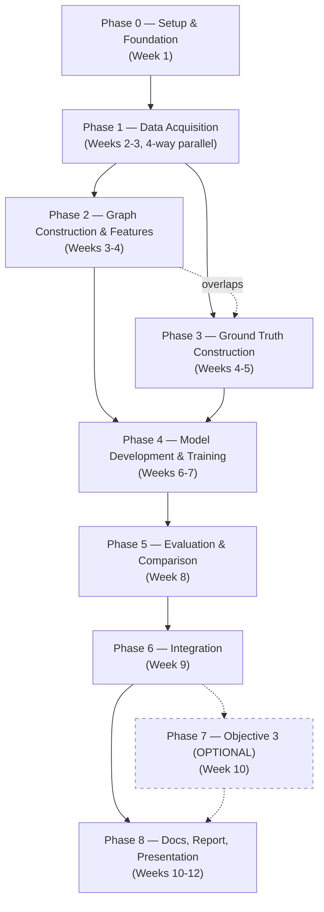
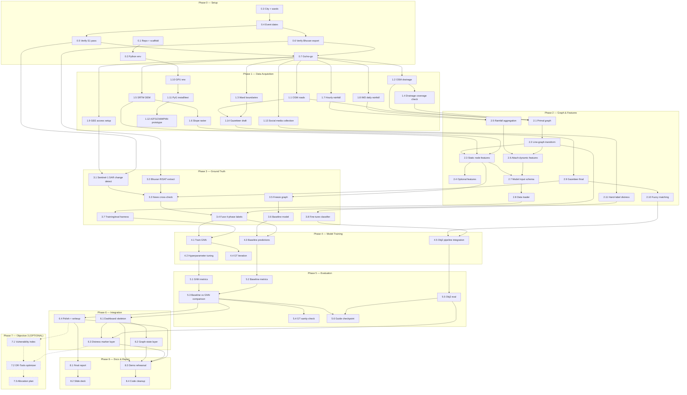
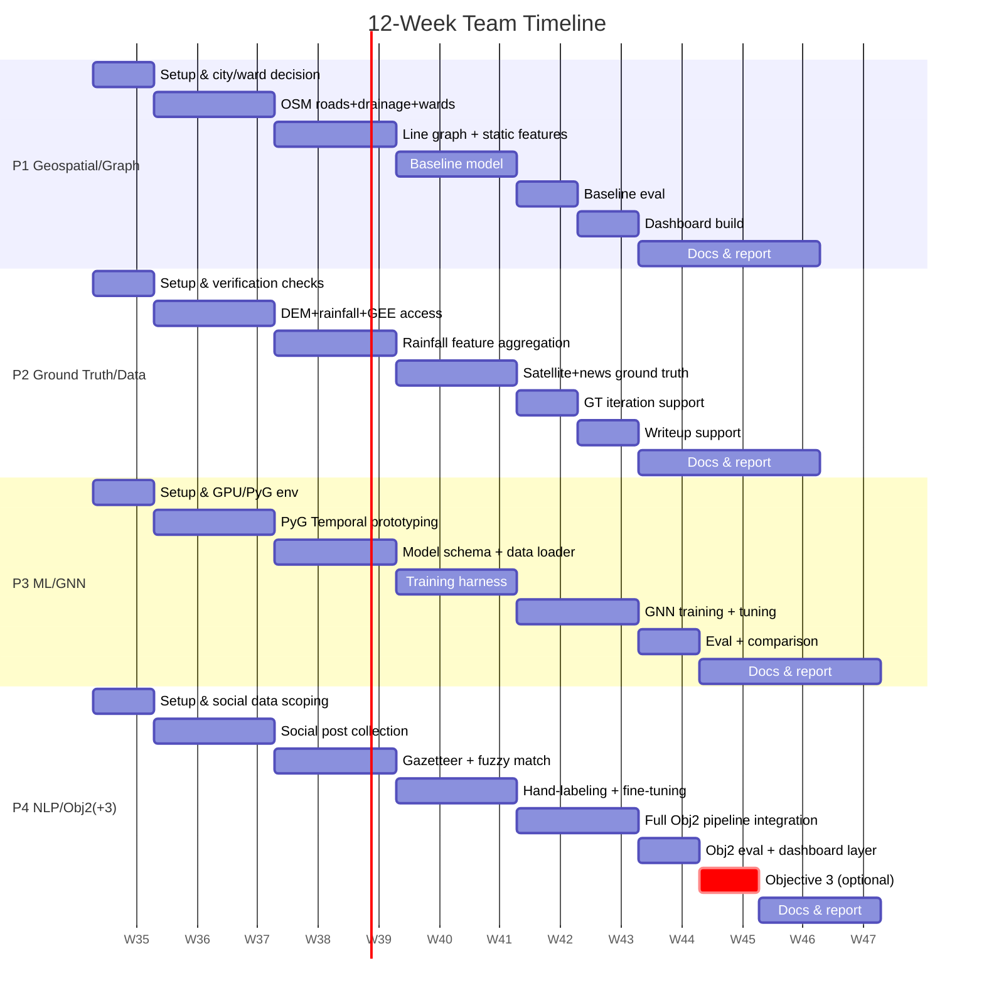

# Building the Project — Team Tracker

This is the **builder's document** — companion to [`working.md`](./working.md), which explains *why* the project is scoped this way and the technical rationale for every decision. This document is about *who does what, when, and in what order*. Update the Status column as you go; that's the whole point of this file.

**Team:** 4 people, labeled P1–P4 in every task table below. Who is P1 vs P2 vs P3 vs P4 is for the team to decide — pick based on interest/skill, not assigned here. Roughly:
- **P1's track** = geospatial & graph work (OSM, DEM, line-graph transform, features)
- **P2's track** = ground truth & data work (satellite, rainfall, label fusion)
- **P3's track** = ML/GNN work (model, training, evaluation)
- **P4's track** = NLP / Objective 2 work (gazetteer, geoparsing, distress classifier), and Objective 3 if attempted

These are tracks, not solo ownership — most phases need cross-support, and a "P1 task" doesn't have to be done by the same person all the way through if you'd rather rotate.

**Timeline:** 12 weeks (~3 months), 8 phases, Phase 7 (Objective 3) optional.

---

## 1. How to read this document

Every task is numbered **`<phase>.<feature>`** — e.g. `0.2` is Phase 0's 2nd feature, `3.4` is Phase 3's 4th. That's literally how you talk about it: *"phase 0 feature 2, let's go."* Each task also has an **Owner** column (P1/P2/P3/P4/All — see the Team note at the top for what each track means) and a **Depends on** column naming the exact ID(s) it needs finished first — not just "depends on graph work." When you finish a task, change its Status from `☐` to `✅`. If a task is blocked, leave it `☐` and check whether its dependency is done yet. `🔶` means everything automatable is done and code-ready, but the task is stuck on one specific manual step (e.g. an interactive login only a human can complete) — check the task's notes for exactly what's left.

Phase 7 (`7.1`–`7.3`) is Objective 3 and is optional — see §11.

---

## 2. Phase dependency map



**Reading this:** Phase 0 gates everything. Phase 1 is where all 4 people work independently at the same time. Phases 2 and 3 *overlap* rather than strictly sequence (P2's ground-truth work can start as soon as Phase 1's satellite/news data lands, it doesn't need P1's feature engineering finished). Phase 4 needs both 2 and 3 complete. Objective 2 (P4's track) runs almost entirely on its own rail from Phase 1 through Phase 5, only rejoining Objective 1's output at Phase 6 (Integration). Phase 7 is dashed because it's optional and only starts if Phase 6 is stable with time left.

## 2b. Feature-level dependency map (every task, not just phases)

This is the detailed version of the flowchart above — every individual feature across all 8 phases, with the real edges between them. Grouped into a box per phase so you can still see the phase shape, but arrows cross phase boundaries wherever a feature actually depends on one from an earlier (or the same) phase. This is the picture to check before saying "phase X feature Y, let's go" — trace its incoming arrows to make sure they're all `✅` first.



## 3. Who's doing what, when (swimlanes)



**Sync points (all 4 people meet):** end of Phase 0 (go/no-go on city/event), end of Phase 3 (ground truth ready), end of Phase 5 (mid-project guide checkpoint), Phase 6 (integration — everyone's output merges), end of Phase 8 (final).

---

## 4. Phase 0 — Setup & Foundation (Week 1)

| # | Task | Owner | Depends on | Status |
|---|---|---|---|---|
| 0.1 | Create GitHub repo + local scaffold | P1 | — | ✅ |
| 0.2 | Set up shared Python environment (`requirements.txt`, venv/conda instructions in README) | P1 | 0.1 | ✅ |
| 0.3 | Finalize study city + select 10–20 contiguous wards | All | — | ✅ |
| 0.4 | Confirm flood event date range (default: Chennai, Nov–Dec 2015 — see working.md §1.9) | All | 0.3 | ✅ |
| 0.5 | Verify a usable Sentinel-1 pass exists near event dates over chosen wards (Copernicus Browser) | P2 | 0.4 | ✅ |
| 0.6 | Verify the Bhuvan RISAT flood-footprint layer is actually exportable, not just a figure caption | P2 | 0.4 | ✅ |
| 0.7 | **Go/no-go decision:** confirm Chennai, or fall back to Bengaluru 2022 | All | 0.5, 0.6 | ✅ |

**Feasibility check results (31 Aug 2026)** — 0.3–0.6 completed and verified, not just assumed; full evidence (polygon-adjacency map, live Sentinel-1 catalog query, Bhuvan accessibility check) is in the [Chennai Study-Area Validation report](https://claude.ai/code/artifact/13744b14-c706-4bde-acf0-0042146e0129):
- **Study wards (16, geometrically confirmed contiguous):** 142, 168, 169, 170–182 (Adyar river corridor — Saidapet down through Kotturpuram/Adyar to Taramani/Velachery). No outliers found; the 168/169 link is a narrow neck worth re-checking once OSM roads land in 1.1.
- **Event window:** 8 Nov – 14 Dec 2015, with **30 Nov – 2 Dec 2015** as the Peak phase anchor (rainfall max + Chembarambakkam reservoir release into the Adyar river).
- **Sentinel-1:** 4 confirmed S1A passes covering the full study area — 12 Nov, 24 Nov, 6 Dec, 18 Dec 2015. None fall inside the peak window itself (nearest is +4 days); Nov 24 → Dec 6 is the usable pre/post change-detection pair. This is now Objective 1's **primary** ground-truth path.
- **Bhuvan/RISAT:** downgraded from "verify" to **at-risk / secondary only** — the footprint is real (cited in literature) but the live portal has no 2015 historical archive and flood layers are raster WMS tiles with no confirmed vector export. Not to be relied on as the primary ground-truth source; pursue via a formal NRSC request in parallel with Phase 1, off the critical path.

`working.md` §1.5, §1.8, and §1.9 have been updated to reflect these verified results in detail.

**0.7 — GO, confirmed 31 Aug 2026.** Proceeding with Chennai, the 16-ward cluster, and the 8 Nov–14 Dec 2015 window, with Sentinel-1 (not Bhuvan) as Objective 1's primary ground truth. This closes Phase 0 based on the feasibility report above; if the rest of the team hasn't reviewed it yet, flag anything that changes their mind before Phase 1 work goes too far.

**0.6 update (01 Sep 2026)** — a teammate obtained an NRSC/ISRO PDF report directly from the Bhuvan portal ("Hydrological Simulation Study of Flood Disaster in Adyar and Cooum Rivers," v1.2, 07 Dec 2015). **Correction: this is not RISAT data** — it's a modeled rainfall-runoff/DEM hydrological simulation, not an observed SAR flood footprint, despite where it was found. Its rainfall/discharge timeline (peaks on 23 Nov and 1 Dec 2015) independently cross-validates the event dates already confirmed above. Its flood-depth map (Fig. 8) was georeferenced (`src/ground_truth/georeference_nrsc_simulation.py`) into an approximate raster clipped to the study wards — RMSE ~563m (coarse; it's an oblique 3D screenshot, not an orthophoto), but it cross-checks well structurally against the independently-sourced OSM waterway layer (see `src/ground_truth/README.md`, `data/raw/bhuvan/qa_overlay.png`).

**Follow-up (01 Sep 2026): tracked the PDF's provenance back to a real historical-flood archive** at `bhuvan-app1.nrsc.gov.in/disaster/usrtasks/flood/flood.php` — a year/state layer tree that **does** list Chennai-2015 entries, including an actual RISAT-1 cumulative-inundation layer and a Cartosat-2 post-event layer. This **corrects the 31 Aug finding that the portal has "no 2015 historical archive"** — it exists, we just hadn't found the right URL. However, tested directly at the WMS protocol level (`src/ground_truth/verify_bhuvan_wms.py`, traces each checkbox through the portal's own JS to the real backend and issues a `GetMap` request): every one of those layer names is dead — `ServiceException: invalid layer` or blank placeholder tiles. The UI still shows them; the backing data has been pruned or moved.

**Verdict unchanged, now on much firmer evidence: Bhuvan/RISAT stays secondary/cross-check only, not primary ground truth.** This doesn't reopen 0.6 or 0.7, it replaces a UI-navigation-based finding with a protocol-level-tested one that happens to reach the same conclusion. `working.md` §1.5/§1.8/§6 updated accordingly.

**Exit criterion for Phase 0 — met.** Phase 1 is now unblocked: OSM extent = the 16-ward cluster, rainfall window = 8 Nov–14 Dec 2015, satellite passes = the 4 confirmed Sentinel-1 dates above.

---

## 5. Phase 1 — Data Acquisition (Weeks 2–3, parallel)

| # | Task | Owner | Depends on | Status |
|---|---|---|---|---|
| 1.1 | Pull OSM road network for study wards (`osmnx`) | P1 | 0.7 | ✅ |
| 1.2 | Pull OSM drainage/waterway layer for study wards | P1 | 0.7 | ✅ |
| 1.3 | Pull/verify ward boundary polygons (DataMeet/BBMP/GCC per city) | P1 | 0.7 | ✅ |
| 1.4 | Manual coverage check of drainage tagging completeness in chosen wards | P1 | 1.2 | ✅ |
| 1.5 | Download SRTM DEM tiles for study area (OpenTopography) | P2 | 0.7 | ✅ |
| 1.6 | Derive slope raster (`gdaldem slope`) | P2 | 1.5 | ✅ |
| 1.7 | Pull hourly rainfall for event window (Open-Meteo API) | P2 | 0.7 | ✅ |
| 1.8 | Pull daily IMD rainfall as cross-check (`imdlib`/`imddaily`) | P2 | 0.7 | ✅ |
| 1.9 | Set up Google Earth Engine access + Sentinel-1 GRD collection query | P2 | 0.7 | ✅ |
| 1.10 | Set up Colab/Kaggle GPU environment | P3 | 0.2 | ✅ |
| 1.11 | Install & smoke-test PyTorch Geometric + PyTorch Geometric Temporal | P3 | 1.10 | ✅ |
| 1.12 | Prototype A3TGCN vs MPNN-LSTM on toy/synthetic graph data | P3 | 1.11 | ✅ |
| 1.13 | Collect social media posts scoped to study wards + event window | P4 | 0.7 | ✅ |
| 1.14 | Draft initial gazetteer (road/locality/landmark names) | P4 | 1.1, 1.3 | ✅ |

**Note the one cross-track dependency in this "parallel" phase:** 1.14 needs 1.1 and 1.3 to exist first (the gazetteer is built from OSM data). Everything else in Phase 1 is fully independent — this is the biggest parallelism window in the whole project.

**1.9 done (01 Sep 2026).** GEE project: **`flood-intelligence-507219`** (noncommercial/research access) — this is the project ID everyone on the team should pass to `ee.Initialize(project=...)` for GEE work going forward. `src/ground_truth/query_sentinel1_gee.py` confirmed all 4 expected Sentinel-1 scenes are reachable in GEE, exact match to the earlier Copernicus catalog check:

| Date | GEE image ID |
|---|---|
| 12 Nov 2015 | `COPERNICUS/S1_GRD/S1A_IW_GRDH_1SDV_20151112T003120_20151112T003149_008564_00C241_37E8` |
| 24 Nov 2015 (pre-event, task 3.1) | `COPERNICUS/S1_GRD/S1A_IW_GRDH_1SDV_20151124T003120_20151124T003149_008739_00C723_AB80` |
| 06 Dec 2015 (post-event, task 3.1) | `COPERNICUS/S1_GRD/S1A_IW_GRDH_1SDV_20151206T003120_20151206T003149_008914_00CC1F_BEF9` |
| 18 Dec 2015 | `COPERNICUS/S1_GRD/S1A_IW_GRDH_1SDV_20151218T003119_20151218T003148_009089_00D0E6_767A` |

**1.10–1.12 done (01 Sep 2026).** No Colab/Kaggle needed — the study laptop has a local NVIDIA RTX 2050 (4GB VRAM), plenty for a ~17k-node line-graph, so the GPU/PyG stack was set up locally instead: `torch==2.13.0+cu126`, `torch_geometric==2.8.0.post1`, `torch_geometric_temporal==0.56.2`. One real snag worth knowing about: `torch-geometric-temporal`'s pinned `torch-scatter`/`torch-sparse` deps have no prebuilt wheel for this torch/Python combo and would need a full MSVC+CUDA toolkit to build from source, so it was installed with `--no-deps` plus a small documented import shim (PyG's own fallback `SparseTensor` class stood in for the one thing `torch_sparse` is needed for — an unused model, `EvolveGCNH` — never a real functional gap). `src/models/gnn/toy_gnn_prototype.py` then ran a real forward+backward pass through both candidate architectures (A3TGCN, MPNN-LSTM) on synthetic data on the GPU — both completed cleanly with gradients flowing. Full details, exact commands, and the shim explanation: `src/models/gnn/README.md`. **This only proves the environment works — no real features, no real labels, no training yet; that's task 2.1+.**

**1.14 done (01 Sep 2026).** `src/nlp/build_gazetteer.py` — 2,168 unique named entries (1,758 roads, 307 landmarks, 89 localities, 14 waterways) across the study wards, 88 with a Tamil name pulled straight from OSM (`name:ta`). This is what task 2.10's fuzzy geoparser will match distress-message place mentions against. Hit and fixed one real environment snag along the way: this laptop sits behind a Sophos TLS-inspection proxy that Python's `certifi` bundle doesn't trust by default, breaking Overpass API calls with `SSLCertVerificationError` — fixed with `pip install pip-system-certs` (defers to the Windows system cert store instead of disabling verification). Full writeup: `src/nlp/README.md`. Still a **draft** — task 2.9 finalizes it once 1.13's real distress text shows which names people actually use.

**1.13 done (01 Sep 2026), with a scope change worth knowing about.** Live social-media collection turned out not to be feasible and this was verified, not assumed: X/Twitter historical search is Enterprise-only (~$42k/month, no research tier since the 2023 Academic API shutdown), and no redistributable public dataset of 2015 Chennai flood tweets exists. Flagged this to the team and got a direct decision: build the corpus from real, publicly accessible reporting instead (ReliefWeb sitreps, an academic retrospective, news coverage with resident interviews), filtered to passages mentioning a task 1.14 gazetteer place. `src/nlp/collect_distress_text.py` — 19 location-mentioning passages from 7 sources, including real first-person resident accounts (Velachery, Kotturpuram). **Disclosed limitation:** this is real text about the real event, but news/report register, not informal social media — task 2.11's hand-labeling works with this register; revisit only if it turns out to matter. Full writeup: `src/nlp/README.md`.

**Phase 1 is now fully complete (1.1–1.14).** Next: Phase 2 (graph & features) — building the actual line-graph from the OSM road network (task 2.1) and attaching the static/dynamic features gathered across P1-P4.

**1.5–1.8 done (01 Sep 2026)** — see `src/ground_truth/fetch_dem.py`, `fetch_rainfall.py`, `fetch_rainfall_imd.py`. DEM/slope came back physically sensible (elevation 0-40m dropping to the coast, St. Thomas Mount visible as a real local high point). **Rainfall did not** — Open-Meteo and IMD disagree by 2-6x on magnitude, and neither cleanly matches the ~240mm/~340-490mm peaks the literature claims for 23 Nov / 1 Dec. Flagged in detail in `working.md` §1.8 with a recommended fix for task 2.5 (IMD for magnitude, Open-Meteo for hourly shape) — **don't aggregate rainfall for the model without reading that note first.**

**1.1–1.4 done (31 Aug 2026)** — see `src/graph/fetch_osm.py` and `src/graph/README.md` for the script, outputs, and the 1.4 coverage-check writeup. Headline numbers: 6,971 road nodes / 17,195 edges (99.1% in one connected component); 39 waterway features, sparsely tagged inside wards as `working.md` §1.8 already anticipated — coverage concentrated along the ward-boundary river/canals rather than interior storm drains. Sanity-check map: `docs/figures/phase1_osm_coverage.png`. Outputs live in `data/raw/wards/` and `data/raw/osm/` (gitignored — rerun the script to regenerate). `requirements.txt`'s `osmnx`/`geopandas`/`networkx` are now confirmed installable and working on this machine.

---

## 6. Phase 2 — Graph Construction & Features (Weeks 3–4)

| # | Task | Owner | Depends on | Status |
|---|---|---|---|---|
| 2.1 | Build primal graph (`networkx`) from OSM road+drainage data | P1 | 1.1, 1.2, 1.4 | ✅ |
| 2.2 | Transform primal → line graph (segment = node) | P1 | 2.1 | ✅ |
| 2.3 | Compute static node features: elevation, slope, length, distance_to_drain | P1 | 2.2, 1.5, 1.6 | ✅ |
| 2.4 | *(Optional)* Compute impervious %, ward population density | P1 | 2.3 | ☐ |
| 2.5 | Aggregate rainfall into phase-window dynamic features (`rainfall_t`, `cumulative_rainfall_t`) | P2 | 1.7, 1.8 | ✅ |
| 2.6 | Attach dynamic features to graph nodes per timestep | P2 | 2.5, 2.2 | ✅ |
| 2.7 | Define model input schema (`X_t`, `edge_index`, `Y_{t+1}` shapes) | P3 | 2.3, 2.6 | ✅ |
| 2.8 | Build graph-snapshot dataset/data-loader class | P3 | 2.7 | ✅ |
| 2.9 | Finalize gazetteer (`name → coordinate` dict) | P4 | 1.14 | ✅ |
| 2.10 | Implement fuzzy string matching pipeline (`rapidfuzz`) against gazetteer | P4 | 2.9 | ✅ |
| 2.11 | Hand-label distress/not-distress dataset (few hundred posts) | P4 | 1.13 | ☐ |

**2.1, 2.2, 2.5, 2.6 done (17 Sep 2026)** — merged via PR [#1](https://github.com/SrivatsalyaBhavaraju/spatiotemporal-flood-intelligence/pull/1) (2.1, `src/graph/build_primal_graph.py`), [#2](https://github.com/SrivatsalyaBhavaraju/spatiotemporal-flood-intelligence/pull/2) (2.2, `src/graph/build_line_graph.py`), [#3](https://github.com/SrivatsalyaBhavaraju/spatiotemporal-flood-intelligence/pull/3) (2.5, `src/features/build_rainfall_phase_features.py`), [#4](https://github.com/SrivatsalyaBhavaraju/spatiotemporal-flood-intelligence/pull/4) (2.6, `src/features/attach_dynamic_node_features.py`). All four re-run end-to-end against the real committed Phase 1 data before merging, not just trusted from PR descriptions: primal graph reproduces Phase 1's recorded 6,971 nodes/17,195 edges exactly; line graph comes out to 17,195 nodes/48,732 edges with a clean segment_id bijection, 0 duplicate edges, 0 junction inconsistencies; bias-corrected rainfall_t lands at 1055.7/31.2/410.1/126.0mm across pre_event/rising/peak/receding (peak within the literature's ~340–490mm range) with cumulative_rainfall_t as the running sum; dynamic features broadcast correctly to all 17,195 segments × 4 phases (68,780 rows). PR #3 needed one fix before merging — it called `pd.option_context("mode.use_inf_as_na", ...)`, an option pandas 3.0 removes outright, which would crash on any fresh `pip install` since `requirements.txt` pins no pandas version; simplified to the existing `.where()` guard (verified byte-identical output) and pushed directly to the PR branch.

**Note on 2.5's phase-window totals:** pre_event's total (1055.7mm over its 20-day window) is larger than peak's (410.1mm over 2 days) simply because the windows are very different lengths — this doesn't contradict peak being correct (410mm matches the literature), but the script's own printed "phase 2 should now be the clear maximum" sanity message is misleading since it's comparing un-normalized window totals. Cosmetic only, not asserted in code, doesn't affect downstream values — worth fixing the message (or switching to average intensity) whenever 2.5 is next touched, no need to reopen now.

**2.3 done (19 Sep 2026)** — merged via PR [#5](https://github.com/SrivatsalyaBhavaraju/spatiotemporal-flood-intelligence/pull/5) (`src/graph/build_static_features.py`). Re-run end-to-end against real committed Phase 1/2.1/2.2 data before merging (2.1/2.2 regenerated locally since `data/processed/` is gitignored), reproducing the PR's own claimed numbers exactly: 17,195 segments, 0 missing elevation/slope/distance_to_drain values, 0 segments with zero valid raster samples. Elevation came out 0–20m (mean 8.2m) with one segment averaging slightly negative (-3.7m) near the coast/backwaters — consistent with the raw SRTM DEM's own min of -19m (task 1.5), not a bug in this PR. distance_to_drain ranged 0–2091m (mean 498m), consistent with 1.4's finding that drainage tagging is sparse and concentrated along ward-boundary waterways rather than interior segments.

**2.7 done (19 Sep 2026)** — merged via PR [#6](https://github.com/SrivatsalyaBhavaraju/spatiotemporal-flood-intelligence/pull/6) (`src/models/gnn/build_model_input_schema.py`). Re-run end-to-end against real committed Phase 1/2.1/2.2/2.3/2.5/2.6 data before merging (2.1/2.2/2.5/2.6 regenerated locally since `data/processed/` is gitignored): `X.npy` shape `(4, 17195, 6)`, `edge_index.npy` shape `(2, 48732)` (reused 2.2's own `node_order()`/`edge_index_array()`, directed per that task's traversal-direction design), 0 missing values across all 6 feature columns, edge indices all in range. `X[0,0,:4]` spot-checked byte-for-byte against `static_features.geojson`'s row for the same segment. Real `Y_{t+1}` labels don't exist yet (task 3.4/Phase 3 hasn't started) — no label file was fabricated; `schema.json` documents the shape/dtype/join-key contract 3.4 must satisfy (3 usable transitions: pre_event→rising, rising→peak, peak→receding).

**Note on `working.md` line 90 ("F = 7 features"):** that line counts §1.7's MUST-HAVE list literally, which bundles "road topology" (structural, = edge_index) and "flood label" (= Y_{t+1}) in with the 5 real per-node scalars, and doesn't itemize `length_m` separately even though §1.3's own node-feature list includes it. Actual per-node feature count in `X_t` is F=6, not 7 — cosmetic doc mismatch, not a functional gap, not fixed upstream, just flagged in the script's docstring.

**2.8 done (19 Sep 2026)** — merged via PR [#7](https://github.com/SrivatsalyaBhavaraju/spatiotemporal-flood-intelligence/pull/7) (`src/models/gnn/build_graph_snapshot_dataset.py`). `GraphSnapshotDataset` wraps 2.7's outputs into one `Data(x, edge_index, y)` per phase, plus `.to_a3tgcn_input()`/`.to_mpnn_lstm_input()` reproducing task 1.12's `toy_gnn_prototype.py` shape conventions exactly. Validated beyond shape-checking: ran a real forward pass through the actual `A3TGCN`/`MPNNLSTM` model classes (not synthetic data) on the full real 17,195-node graph via this loader — both completed cleanly on GPU, output shapes `(17195, 1)` and `(17195, 25)` (matches `MPNNLSTM`'s own `2*hidden+in_channels+periods-1` formula). `attach_labels()` is ready to accept task 3.4's fused labels once they exist — validated against schema.json's `y_t1_contract` — but no labels are attached yet since Phase 3 hasn't started.

**2.9 done (19 Sep 2026)** — merged via PR [#10](https://github.com/SrivatsalyaBhavaraju/spatiotemporal-flood-intelligence/pull/10) (`src/nlp/finalize_gazetteer.py`). Re-fetched all 146 paragraphs from task 1.13's source pages (not just the 19 that survived that task's gazetteer-match pre-filter, which structurally can't reveal a missing name) and extracted 234 novel 2+-word candidate place names not already in the 1,787-name draft. Checking them against live OSM hit two real infrastructure problems, both fixed in this PR: a single 234-name query hit `413 Request Entity Too Large` on the one mirror that accepted a connection (fixed by batching into groups of 25), and two of three public Overpass mirrors (`overpass-api.de`, its `lz4` load-balanced node) consistently failed to connect at all on this network throughout development (fixed by trying the working mirror, `overpass.kumi.systems`, first). Even fixed, that connection stayed intermittently flaky — 6 of 10 batches failed on every mirror/attempt in the merged run. Net result: **109/234 candidates actually checked, 5 resolved to a real OSM feature** (Chennai Corporation, Gandhi Road, Kuberan Nagar, Royal Enfield, World Bank), 104 confirmed no match, **125 honestly recorded as unverified** (not confirmed-absent) rather than blocked on or faked.

**Two of the 5 resolved matches are probably not what the source text meant, kept anyway on purpose:** "World Bank" and "Royal Enfield" most likely matched a coincidentally-named local shop and a motorcycle showroom rather than the international org / rescue-vehicle brand the distress text almost certainly referenced. Discussed directly — kept in the output rather than hand-excluded, since picking off inconvenient real OSM matches after the fact would just be the hand-curated semantic denylist this script's design was built to avoid (see its docstring's "Method" step 4). Flagged clearly for a human spot-check, same as task 1.14's own draft was.

**2.10 done (19 Sep 2026)** — merged via PR [#11](https://github.com/SrivatsalyaBhavaraju/spatiotemporal-flood-intelligence/pull/11) (`src/nlp/fuzzy_geoparse.py`). Sliding n-gram window + `rapidfuzz` fuzzy match against 2.9's gazetteer + overlap resolution (one text span → one place). Tried `fuzz.WRatio` (rapidfuzz's own default) first and rejected it on real data: its partial-containment scoring made generic single words spuriously match any longer name containing them ("road" vs "Gandhi Road" → 90.0) — a real risk given ~1,758 of the gazetteer's entries are literally "`<name>` Road"/"`<name>` Nagar". Plain `fuzz.ratio` fixed that (53.3, 62.5 for the same pairs) while still catching real typos ("tansi ngr" vs "tansi nagar" → 90.0); `SCORE_CUTOFF=85` checked against ordinary English words with none scoring above it. **Validated against task 1.13's real corpus, not synthetic examples:** initial raw recall vs. the exact-substring baseline was 87.1% (27/31) — traced the 4 "misses" to the baseline double-counting one mention twice (e.g. "the Adyar river" independently substring-matches both "Adyar" and "Adyar River"; this pipeline's overlap resolution correctly keeps only the more specific one), and after excluding that artifact recall is **100%**, plus **5 genuine extra matches** (typo/spacing variants, and "Kuberan Nagar" — a name 2.9 added to the gazetteer after this corpus was originally built).

**Next:** 2.4 (optional impervious %/ward density) and Phase 3 (ground truth fusion — 3.3 news cross-check is now fully unblocked, feeding 3.4, the critical-path exit criterion per developing.md §7) are the open items.

---

## 7. Phase 3 — Ground Truth Construction (Weeks 4–5)

This is the highest-risk phase in the project (see working.md §1.5) — treat 3.1–3.4 as the critical path.

| # | Task | Owner | Depends on | Status |
|---|---|---|---|---|
| 3.1 | Run Sentinel-1 SAR change detection in GEE (before/after backscatter) | P2 | 1.9, 0.5 | ✅ |
| 3.2 | Extract Bhuvan RISAT flood footprint (if Chennai chosen) | P2 | 0.6 | ✅ |
| 3.3 | Cross-check with news/traffic advisories; geocode named roads via gazetteer | P2 | 2.9, 3.1, 3.2 | ✅ |
| 3.4 | **Fuse into 4-phase label scheme** (Pre-event / Rising / Peak / Receding) per segment | P2 | 3.3, 2.2 | ✅ |
| 3.5 | Freeze graph structure (no more topology changes after this point) | P1 | 2.3 | ✅ |
| 3.6 | Build rule-based baseline propagation model | P1 | 3.5 | ☐ |
| 3.7 | Build training/eval harness skeleton (phase-based train/test split, metrics) | P3 | 2.8 | ☐ |
| 3.8 | Fine-tune MuRIL/IndicBERT distress classifier on labeled data | P4 | 2.11 | ☐ |

**Exit criterion for Phase 3:** 3.4 checked off — this is the mid-project sync point. Phase 4 cannot meaningfully start without fused ground truth.

**3.1 done (19 Sep 2026)** — merged via PR [#8](https://github.com/SrivatsalyaBhavaraju/spatiotemporal-flood-intelligence/pull/8) (`src/ground_truth/run_sentinel1_change_detection.py`). Pre/post VV backscatter change (24 Nov pre → 6 Dec 2015 post, task 1.9's confirmed pass pair) thresholded at `mean - 2*std` on the AOI's own change distribution — chosen only after two standard alternatives were tried directly on the real data and rejected: a fixed -17dB literature threshold (UN-SPIDER's common VV default) flagged just 0.08% of valid post-event pixels in this dense-urban scene (near-empty ~0.01 km² result — buildings' double-bounce backscatter runs higher than the open terrain that default assumes), and Otsu's method on the diff histogram flagged 54% of the AOI (no real bimodal split to find; flooding is a minority-class tail on one noisy mode, not two separable populations). Real run against live GEE: **449 flood polygons, 0.60 km² total (~1.3% of the ~46.6 km² AOI)**, touching **all 16 of 16 study wards** — Perungudi (Ward 169) highest at 0.0941 km², Adyar (Ward 181) lowest at 0.0054 km² (corrected 19 Sep 2026 in PR #9, see below — an earlier version of this note wrongly said only 3 wards showed flooding). Cross-checked against task 0.6's georeferenced NRSC simulation raster: mean depth at flood-polygon centroids (2.94m) exceeds random-point depth (2.62m) — corroborating, not proof, given that raster's own ~563m RMSE.

**Read this as a floor, not the full picture:** `working.md` §1.5 already documents SAR's dense-urban-canopy blind spot — 0.60 km² across the whole 16-ward cluster is still a small fraction of the ~46.6 km² AOI, and this before/after pass pair also brackets the 30 Nov–2 Dec peak rather than capturing it (nearest pass is +4 days post-peak). Task 3.3 (news/advisory cross-check) is explicitly the step meant to catch what SAR misses.

**3.2 done (19 Sep 2026)** — merged via PR [#9](https://github.com/SrivatsalyaBhavaraju/spatiotemporal-flood-intelligence/pull/9) (`src/ground_truth/extract_bhuvan_flood_footprint.py`). Re-verified live (re-ran `verify_bhuvan_wms.py`, not just cited the old result) that Chennai's actual RISAT-1/Cartosat-2 WMS layers are still dead — no exportable RISAT SAR footprint exists for this event, unchanged from task 0.6. Extracted a polygon instead from the one real Bhuvan-sourced artifact this project has: task 0.6's follow-up georeferenced NRSC hydrological-simulation depth raster, thresholded at a 0.1m noise floor (95.8% of the raster already shows >0.1m depth — the source figure's colored region already **is** the claimed inundation zone, not something a threshold discriminates within) and vectorized by reusing 3.1's `sieve_mask()`/`vectorize_mask()`/`clip_to_wards()` directly. Real run: **35 polygons, 21.66 km² total, touching 14 of 16 wards**; cross-checked against 3.1's Sentinel-1 result — 38.9% of the Sentinel-1 flood area falls inside this Bhuvan/NRSC zone, meaningful overlap given the two methods' opposite biases (SAR underestimates; this coarse ~563m-RMSE simulation likely overestimates). **Stays secondary/opportunistic only** (task 0.6's verdict) — 3.3/3.4 should weight Sentinel-1 as primary.

**Bug found and fixed while building 3.2, in already-merged 3.1 code:** `validate_flood_extent()`'s per-ward report keyed flooded area on `Zone_Name` alone, but 13 of the 16 study wards all share `Zone_Name="ADYAR"` (distinguished only by `Ward_No`) — each subsequent Adyar ward's area was silently overwriting the previous one instead of summing, which is why 3.1's original merged note above wrongly said flooding was "concentrated in only 3 of 16 wards." Only that report field was wrong — the flood polygon geometries and 0.60 km² total were never affected. Fixed in a shared `per_ward_area_breakdown()` (keyed on a ward-unique label, accumulates) both scripts now use, with a regression test reproducing the exact real-data shape.

**3.3 done (19 Sep 2026)** — merged via PR [#12](https://github.com/SrivatsalyaBhavaraju/spatiotemporal-flood-intelligence/pull/12) (`src/ground_truth/cross_check_news_advisories.py`). Geoparses the real distress/news corpus (task 2.10's fuzzy matcher) against task 2.9's gazetteer, resolves each uniquely-mentioned place to line-graph segments (exact OSM `name` match tried first regardless of gazetteer `type`, else every segment in the place's containing ward), and cross-checks against 3.1/3.2's satellite extents. **Bug found and fixed on the first real run:** the gazetteer's `ward_no` column is `float64` (pandas' default once any row has a `NaN`) while `study_wards.geojson`'s `Ward_No` is `int32` — naive string comparison (`"177.0" == "177"` → `False`) meant the ward-fallback resolved **zero segments** for all 22 ward-level places despite them appearing to "resolve." Fixed by comparing as numbers, with a regression test using the exact real-data shape. Real result: 69 resolved mentions across 23 unique places → **13,939 of 17,195 segments news-flagged (81% of the graph)** — broad by design, since the retrospective/encyclopedia sources discuss the flood citywide across nearly all 16 wards, and the ward-level fallback (same coarseness as 3.2) flags every segment in a mentioned ward, not just the specific spot. Cross-checked: 5.6% overlap Sentinel-1, 47.8% overlap Bhuvan/NRSC, and **48.3% (6,736 segments) are news-only** — the concrete "catches what SAR misses" value this task is named for.

**Not phase-resolved, by design:** checked directly whether the real corpus carries per-passage dates — it doesn't (only one of 19 original passages' own source URL has any date range). A news-flagged segment means "flooded at some point during the event," not "flooded in phase X." Task 3.4's fusion has to decide how to use a phase-unresolved signal.

**3.4 done (19 Sep 2026) — Phase 3's exit criterion met** — merged via PR [#13](https://github.com/SrivatsalyaBhavaraju/spatiotemporal-flood-intelligence/pull/13) (`src/ground_truth/fuse_flood_labels.py`). `ever_flooded = intersects(3.1) OR intersects(3.2) OR flagged-by(3.3)` — working.md's own rule, extended across all three sources. **Two decisions confirmed directly with the user before implementing/finalizing, not silently chosen:** (1) phase assignment — none of the three sources are phase-resolved, so `ever_flooded` gets assigned to **peak and receding only** (pre_event/rising stay dry), grounded in task 2.5's rainfall numbers (rising 31mm/2days vs. peak 410mm/2days, a 13x contrast); (2) whether to keep the literal OR-fusion rule despite it producing a very high flooded rate, or require 2+ sources to agree for a tighter signal — kept the literal OR rule since that's what working.md actually specifies. Real result: SAR (primary) flags 5.4% of segments, Bhuvan 44.4%, news 81.1% → union is **15,038/17,195 segments (87.46%) flooded at peak/receding**, dominated by the two coarse secondary sources rather than the primary one (only 1.4% of segments have all 3 sources agreeing, 40.7% have 2, 45.4% rest on exactly 1). Per-source columns (`sar_flagged`/`bhuvan_flagged`/`news_flagged`/`n_sources_agreeing`) are saved in the output specifically so task 4.x can re-derive a stricter subset later without rerunning this script, if 87% turns out to limit what the GNN can learn.

**Validated beyond "does it run":** ran a real integration check against task 2.8's actual `GraphSnapshotDataset` — `attach_labels()` accepted the fused table and `transition_pairs()` produced exactly the 3 usable `(X_t, Y_{t+1})` pairs `schema.json` promises, each with correct `(17195, 6)`/`(17195, 1)` shapes. Concrete proof, not just an assertion, that Phase 4 (GNN training) can now start.

**3.5 done (19 Sep 2026)** — merged via PR [#14](https://github.com/SrivatsalyaBhavaraju/spatiotemporal-flood-intelligence/pull/14) (`src/graph/verify_graph_freeze.py`). A checksum-based freeze contract (`FROZEN_FINGERPRINT`: node count, edge count, SHA256 of the sorted segment_id set) committed as code rather than a new data file, since `data/processed/` stays regenerable-only throughout this repo. Not a non-determinism safeguard — the 2.1/2.2 pipeline was re-run 5+ times this session with identical `6,971/17,195` primal and `17,195/48,732` line-graph counts every time — this is a **process commitment**: no more edits to `build_primal_graph.py`/`build_line_graph.py`, the AOI, or an OSM re-pull without deliberately updating the fingerprint and re-verifying everything built on top. Real run: exact match, no drift, and both downstream tables checked (task 2.3's `static_features.geojson`, task 2.7's `node_order.json`) carry exactly the frozen segment_id set. **Graph topology is frozen as of this commit.**

**Next:** Phase 4 (model training, 4.1+) can now start for real — 3.4's fused labels + 2.8's data loader are both ready, and 3.5 confirms the graph itself won't shift under them. 3.6/3.7 (P1/P3: rule-based baseline, training harness) remain the open Phase 3 items.

---

## 8. Phase 4 — Model Development & Training (Weeks 6–7)

| # | Task | Owner | Depends on | Status |
|---|---|---|---|---|
| 4.1 | Train GraphSAGE + temporal layer (A3TGCN/MPNN-LSTM) on fused ground truth | P3 | 3.4, 3.7 | ☐ |
| 4.2 | Hyperparameter tuning | P3 | 4.1 | ☐ |
| 4.3 | Run baseline model predictions across all phases | P1 | 3.6, 3.4 | ☐ |
| 4.4 | Iterate/fix ground-truth issues surfaced during training (feedback loop) | P2 | 4.1 | ☐ |
| 4.5 | Integrate classifier + gazetteer resolution into one end-to-end Objective 2 pipeline | P4 | 2.10, 3.8 | ☐ |

---

## 9. Phase 5 — Evaluation & Comparison (Week 8)

| # | Task | Owner | Depends on | Status |
|---|---|---|---|---|
| 5.1 | Compute F1/accuracy per phase transition — GNN model | P3 | 4.2 | ☐ |
| 5.2 | Compute F1/accuracy per phase transition — baseline model | P1 | 4.3 | ☐ |
| 5.3 | **Baseline vs. GNN comparison** — plots/tables, test the core claim (working.md §1.6) | P1 + P3 | 5.1, 5.2 | ☐ |
| 5.4 | Sanity-check ground truth against any comparison anomalies | P2 | 5.3 | ☐ |
| 5.5 | Evaluate Objective 2 precision/recall (classification + geoparsing accuracy) | P4 | 4.5 | ☐ |
| 5.6 | **Mid-project guide checkpoint meeting** | All | 5.3, 5.5 | ☐ |

---

## 10. Phase 6 — Integration (Week 9)

| # | Task | Owner | Depends on | Status |
|---|---|---|---|---|
| 6.1 | Build Streamlit/Folium dashboard skeleton | P1 | 5.3 | ☐ |
| 6.2 | Add graph-state animation layer (baseline vs. GNN over time) | P1 | 6.1 | ☐ |
| 6.3 | Add distress marker layer from Objective 2 | P4 | 6.1, 5.5 | ☐ |
| 6.4 | Polish model outputs and write up results | P2 + P3 | 5.3 | ☐ |

**This is where Objective 1 and Objective 2 visibly become one system** — the dashboard is the artifact that proves it.

---

## 11. Phase 7 — Objective 3 (OPTIONAL, Week 10)

> Only start this phase if Phases 1–6 are complete and stable with time to spare. If not — skip straight to Phase 8. The project is fully defensible on Objectives 1 and 2 alone (see working.md §3.3, §7).

| # | Task | Owner | Depends on | Status |
|---|---|---|---|---|
| 7.1 | Build ward-level vulnerability index (Census 2011 proxies) | P4 | 6.4 | ☐ |
| 7.2 | Set up OR-Tools/PuLP constrained optimizer | P4 | 7.1, 6.3 | ☐ |
| 7.3 | Produce ranked/allocated resource plan per ward | P4 | 7.2 | ☐ |

---

## 12. Phase 8 — Documentation, Report, Presentation (Weeks 10–12)

| # | Task | Owner | Depends on | Status |
|---|---|---|---|---|
| 8.1 | Write final report | All | 6.4 | ☐ |
| 8.2 | Prepare slide deck | All | 8.1 | ☐ |
| 8.3 | Demo rehearsal | All | 6.1, 6.2, 6.3, 6.4 | ☐ |
| 8.4 | Code cleanup + README finalization | All | 8.3 | ☐ |

---

## 13. Git workflow

- **Branch naming:** `p1/feature-name`, `p2/feature-name`, etc. — prefix by owner track, e.g. `p1/line-graph-transform`, `p3/gnn-training-loop`.
- **No direct commits to `main`.** Open a PR, get at least one other teammate to skim it (doesn't need to be a deep review — mainly a sanity check that it runs), then merge.
- **Commit early, commit often** — small commits scoped to one task ID make it easy to trace "which commit closed 3.4" later, for the report.
- Reference the task ID in commit messages/PR titles where possible, e.g. `2.2: primal to line graph transform`.

## 14. Repo structure

```
spatiotemporal-flood-intelligence/
├── README.md
├── working.md              — technical rationale & research (read this first)
├── developing.md            — this file
├── requirements.txt
├── .gitignore                (data/raw, .venv, __pycache__, checkpoints)
├── data/
│   ├── raw/                  (gitignored — too large to commit)
│   ├── processed/            (gitignored, or small samples only)
│   └── README.md             (how to re-fetch each dataset — see working.md §1.8)
├── src/
│   ├── graph/                 (P1 — OSM extraction, line-graph transform, static features)
│   ├── ground_truth/          (P2 — satellite/rainfall processing, label fusion)
│   ├── models/
│   │   ├── baseline/          (P1/P2 — rule-based propagation)
│   │   └── gnn/                (P3 — GraphSAGE / temporal GNN)
│   ├── nlp/                    (P4 — gazetteer, classifier, geoparsing)
│   ├── optimizer/               (P4 — Objective 3, optional)
│   └── dashboard/
├── notebooks/                  (exploratory work, one subfolder per person)
├── tests/
└── docs/figures/
```

## 15. Milestone checkpoints (guide meetings)

| Milestone | When | What to show |
|---|---|---|
| M1 | End of Phase 0 | City/ward/event finalized, verified feasible |
| M2 | End of Phase 3 | Graph built, fused ground truth ready |
| M3 | End of Phase 5 | Baseline vs. GNN comparison results, Objective 2 metrics |
| M4 | End of Phase 8 | Full demo, report, final presentation |
